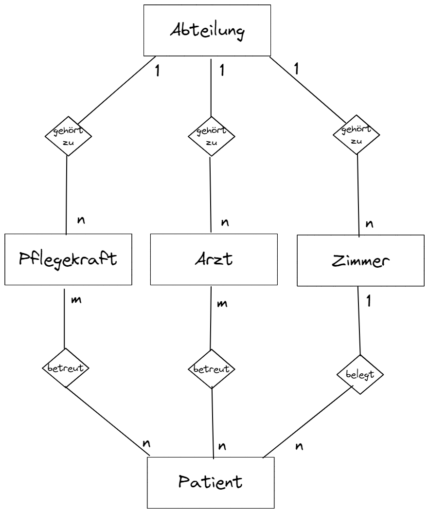
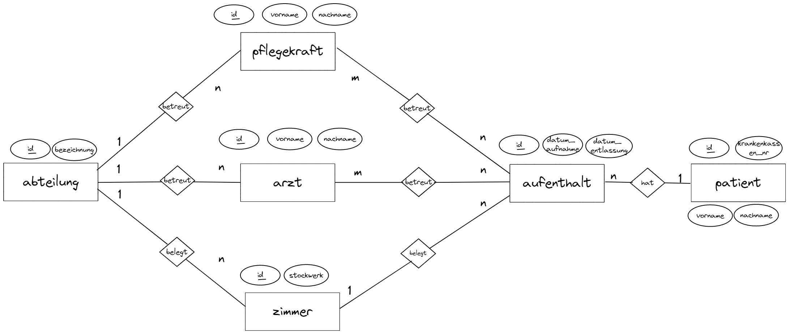
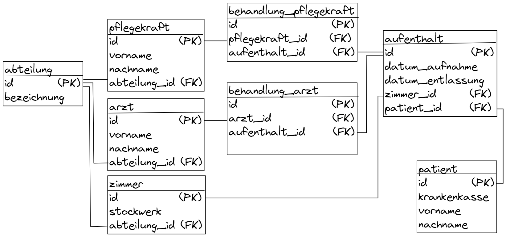

# Aufgabenstellung

Projektaufgabe:
**Krankenhaus Abteilungsverwaltung**
In einem Krankenhaus soll eine Datenbank zur Abteilungsverwaltung eingerichtet werden. Wichtige
Informationen über Patienten, Ärtze und Schwestern sollen damit abfragbar sein.
Die Datenbank soll in der Lage sein, folgende Informationen zu liefern:
- Welche Ärzte behandeln welche Patienten?
- Welches Zimmer kann einem neuen Patienten zugeordnet werden?
- Wie viele freie Zimmer hat die Chirurgie heute?
- Welche Ärzte arbeiten in der HNO-Abteilung?
- Für welches Zimmer ist Oberschwester "Hilde" zuständig?


Hinweise: Ein Zimmer ist genau zu einer Abteilung zugeordnet. Jeder Arzt und jedes Mitglied des
Pflegepersonals ist genau einer Abteilung zugeordnet.
Entitäten aus dem Text: Patient, Arzt, Pflegepersonal, Zimmer, Abteilung


- Erstellen Sie ein entsprechendes ER-Diagramm mit Attributen.  
- Überführen Sie das ER-Diagramm in das relationale Modell.  
- Danach erstellen Sie die Datenbank mit SQL-Anweisungen.  
Speichern Sie die Anweisungen in einer Textdatei.  
- Formulieren Sie Abfragen und speichern diese als VIEW ab, die die oben genannten Fragen beantworten.  
- Erstellen Sie ein Dokument (eine Seite) indem Sie Ihre Vorgehensweise beschreiben.  
- In einer Präsentation (maximal 15 Minuten) mit 8-10 Folien beschreiben
Sie Ihr Datenbankmodell, begründen Ihre Vorgehensweise,  
beschreiben Ihre Umsetzung in SQL und geben ein Fazit,  
ob die oben genannten Fragen umgesetzt sind.  

# Dokumentation

1) Konzeption und Erstellen des ER-Diagrammes
2) Erstellung des Relationenmodells
3) Erstellung der SQL Befehle

## 1. Konzeption und Erstellen des ER-Diagrammes
Erstellen eines ersten ER-Entwurfes anhand der Anforderungen.



Überprüfen ob alle Anforderung von diesem Entwurf abgedeckt werden.   
Anpassung des Modells an die Anforderungen nötig:  



## 2. Erstellung des Relationenmodells
Auflösen der n-m Beziehungen in gesonderten Tabellen mit passenden attributen.  
- behandlung_arzt zwischen Tabellen aufenthalt und arzt
- behandlung_pflegekraft zwischen Tabellen aufenthalt und pflegekraft

Festlegen der Primär und Fremdschlüssel und ihrer Zugehörigkeit.  
erstellen des Relationenmodells:



Überprüfen ob alle Anforderung von diesem Entwurf abgedeckt werden.

## # SQL- CREATE DATABASE, CREATE TABLES

```

--- Create DATABASE ---
DROP DATABASE IF EXISTS kh_abteilungsverwaltung;                    #delete existing database to start from clean state
CREATE DATABASE kh_abteilungsverwaltung;
USE kh_abteilungsverwaltung;

--- Create Tables ---
CREATE TABLE 
	abteilung(id INT AUTO_INCREMENT PRIMARY KEY, 
		bezeichnung VARCHAR(60)
);

CREATE TABLE 
	pflegekraft(id INT AUTO_INCREMENT PRIMARY KEY, 
		vorname VARCHAR(60), nachname VARCHAR(60),
        abteilung_id INT, 
        FOREIGN KEY (abteilung_id) REFERENCES abteilung(id)
);

CREATE TABLE 
	arzt(id INT AUTO_INCREMENT PRIMARY KEY, 
		vorname VARCHAR(60), nachname VARCHAR(60),
        abteilung_id INT, 
        FOREIGN KEY (abteilung_id) REFERENCES abteilung(id)
);

CREATE TABLE 
	zimmer(id INT AUTO_INCREMENT PRIMARY KEY, 
		stockwerk INT,
        abteilung_id INT, 
        FOREIGN KEY (abteilung_id) REFERENCES abteilung(id)
);

CREATE TABLE 
	patient(id INT AUTO_INCREMENT PRIMARY KEY, 
		vorname VARCHAR(60), nachname VARCHAR(60), krankenkasse VARCHAR(30)
);

CREATE TABLE 
	aufenthalt(id INT AUTO_INCREMENT PRIMARY KEY, 
		datum_aufnahme DATE,
        datum_entlassung DATE,
        zimmer_id INT,
        patient_id INT,
        FOREIGN KEY (zimmer_id) REFERENCES zimmer(id),
        FOREIGN KEY (patient_id) REFERENCES patient(id)
);
CREATE TABLE 
	behandlung_pflegekraft(id INT AUTO_INCREMENT PRIMARY KEY, 
		pflegekraft_id INT,
        aufenthalt_id INT, 
        FOREIGN KEY (pflegekraft_id) REFERENCES pflegekraft(id),
        FOREIGN KEY (aufenthalt_id) REFERENCES aufenthalt(id)
);

CREATE TABLE 
	behandlung_arzt(id INT AUTO_INCREMENT PRIMARY KEY, 
		arzt_id INT,
        aufenthalt_id INT, 
        FOREIGN KEY (arzt_id) REFERENCES arzt(id),
        FOREIGN KEY (aufenthalt_id) REFERENCES aufenthalt(id)
);


```

## # SQL fill test-data to test queries


```
INSERT INTO 
    abteilung(bezeichnung)
VALUES
    ("HNO"), 
    ("Chirurgie")
;

INSERT INTO 
    pflegekraft(vorname, nachname, abteilung_id)
VALUES
    ("Hilde", "Bingen", 1),
    ("Gertrude", "Smith", 2),
    ("Adam", "Sanders", 1)
;

INSERT INTO 
    arzt(vorname, nachname, abteilung_id)
VALUES
    ("Dieter", "Ohrenarzt", 1),
    ("Dennis", "Knochenbrecher", 2)
;

INSERT INTO                                 #5 Zimmer im 1OG für HNO, 4 Zimmer im 2OG für Chirurgie
    zimmer(stockwerk, abteilung_id)
VALUES
    (1, 1),
    (1, 1),
    (1, 1),
    (1, 1),
    (1, 1),
    (2, 2),
    (2, 2),
    (2, 2),
    (2, 2)
;

INSERT INTO 
    patient(vorname, nachname, krankenkasse)
VALUES
    ("Paula", "Friedrichs", "AOK-04351-156547"),
    ("Peter", "Horst", "TK-00503-125125"),
    ("Tropfende", "Nase", "TK-00503-125125"),
    ("Taubes", "Ohr", "TK-00503-125125")
;

--- patienten die schon wieder entlassen wurden
INSERT INTO 
    aufenthalt(datum_aufnahme, datum_entlassung, zimmer_id, patient_id)
VALUES
    ("2021-12-1", "2021-12-20", 3, 1)
;

--- patienten die noch in behandlung sind
INSERT INTO 
    aufenthalt(datum_aufnahme, zimmer_id, patient_id)
VALUES
    ("2022-1-5", 6, 1),
    ("2022-1-8", 8, 2),
    ("2022-1-19", 1, 3),
    ("2022-2-22", 2, 4)
;

--- behandlungen die die Ärtzte vorgenommen haben. Liefert Ergebnisse für erste Anfrage
INSERT INTO 
    behandlung_arzt(arzt_id, aufenthalt_id)
VALUES
    (1, 1),                                     #patient wurde 2 mal von HANO arzt behandelt
    (1, 1),
    (2, 2),                                     #chirurgischer Eingriff arzt
    (2, 3),                                     #chirurgischer Eingriff arzt
    (1, 4),                                     #hno Eingriff arzt
    (1, 5),                                     #hno Eingriff arzt
    (1, 5)                                     #hno  Eingriff arzt
;

```


## # SELECT queries

```
--- Welche Ärzte behandeln welche Patienten ---
SELECT arzt.id, arzt.nachname, arzt.vorname, 
        patient.id, patient.nachname, patient.vorname
    from arzt 
    INNER JOIN behandlung_arzt ON arzt.id=arzt_id
    INNER JOIN aufenthalt ON aufenthalt.id=aufenthalt_id
    INNER JOIN patient ON patient.id=patient_id
    WHERE datum_entlassung IS NOT null                      # filter out already released patients
    GROUP BY arzt.id, patient.id                            # filter out double entries where doc did multiple procedures
;

--- Welches Zimmer kann einem neuen Patienten zugeordnet werden? ---
SELECT *                                                    #Liste aller freien Zimmer gesucht
from zimmer 
LEFT JOIN (
    SELECT zimmer.id AS id                                  # alle zimmer die momentan belegt sind
    FROM zimmer
    INNER JOIN aufenthalt ON zimmer.id=zimmer_id
    WHERE datum_entlassung IS NULL
) AS t2 On zimmer.id = t2.id
WHERE t2.id is null                                         # alle zimmer die momentan frei sind
;


--- Wie viele freie Zimmer hat die Chirurgie heute? ---
SELECT COUNT(*)                                             # modify query from above
from zimmer 
LEFT JOIN (
    SELECT zimmer.id AS id
    FROM zimmer
    INNER JOIN aufenthalt ON zimmer.id=zimmer_id
    WHERE datum_entlassung IS NULL
) AS t2 On zimmer.id = t2.id
INNER JOIN abteilung ON abteilung.id=abteilung_id
WHERE t2.id is null AND abteilung.bezeichnung="Chirurgie"
;

--- Welche Ärzte arbeiten in der HNO-Abteilung ---
SELECT *
FROM arzt
INNER JOIN abteilung ON abteilung.id= abteilung_id
WHERE abteilung.bezeichnung="HNO"
;

--- Für welche Zimmer ist Oberschwerster "Hilde" zuständig---
select zimmer.id AS ZimmerNr, zimmer.stockwerk, pflegekraft.vorname
FROM pflegekraft
INNER JOIN abteilung ON pflegekraft.abteilung_id=abteilung.id
RIGHT JOIN zimmer    ON zimmer.abteilung_id     =abteilung.id
WHERE pflegekraft.vorname = "Hilde"
;

```

